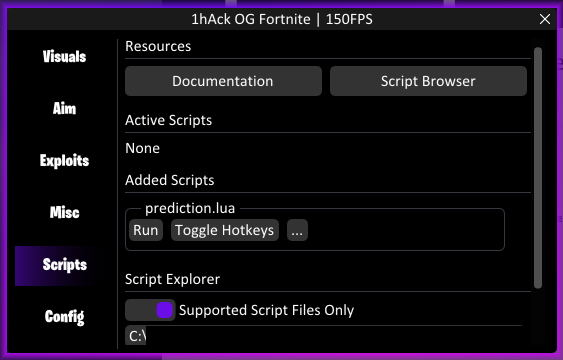
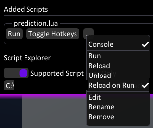

# Introduction to Creating Your Own Scripts

Congratulations on taking the first step toward creating your own scripts! This journey is not only rewarding but can also be a fun and educational experience. Let's dive into what you need to know to make your first useful script.

## Table of Contents

This documentation is designed as a step-by-step guide to help you get familiar with the Lua Engine and its functionalities. We highly recommend going through these sections in the order they are presented for the best learning experience.

- [Understanding Lua](#understanding-lua) - Get an introduction to the Lua programming language and why it's chosen for this engine.

- [Why LuaJIT](#why-luajit) - Understand the advantages of using LuaJIT over standard Lua.

- [Learn Lua](#learning-resources-for-lua) - Discover resources to kickstart or deepen your Lua programming knowledge.

- [Setting up your Environment](#setting-up-your-environment) - Guidelines for setting up your development environment for efficient scripting.

- [Threads](#understanding-threads) - A deep dive into how threading works in this Lua Engine.

- [Events](#working-with-events) - Learn about the various events you can handle in your script for diverse functionality.

- [Libraries](#using-libraries) - An overview of the different kinds of libraries you can leverage for efficient and powerful scripting.

- [Ready to Dive In?](#ready-to-dive-in) - Final thoughts and additional resources to get you started on your scripting journey.

## Understanding Lua

[Lua](https://lua.org) is a programming language used in many applications to offer highly customizable features. It allows users to define their own functions and routines, essentially creating new features for an application. 1hAck OG Fortnite employs Lua for the same purpose - making it easier for you to add your own functionalities with minimal hassle. Though this involves some programming, don't worry; learning Lua is quite straightforward.

The first thing you'll want to do is familiarize yourself with Lua's basics. Thankfully, it's a simple language to learn, especially if you have prior coding experience. Even if you're a complete beginner, Lua's basic features can be grasped in just a few hours.

## Why LuaJIT?

We've decided to use [LuaJIT](https://luajit.org/) over standard Lua because it's faster, which is crucial for our needs. LuaJIT is so optimized that, unless you write poorly designed or very complex code, you shouldn't experience significant performance issues like FPS drops. However, it's worth noting that LuaJIT only supports Lua 5.1. So, features from Lua 5.2 or later won't be available in this Lua Engine.

---

## Learning Resources for Lua

Before you proceed, it's essential to have a basic understanding of Lua. Here are some recommended resources:

- [Learn Lua in 100 Seconds](https://www.youtube.com/watch?v=jUuqBZwwkQw)

- [Lua Full Course](https://youtu.be/1srFmjt1Ib0?si=thqQcE8FfHfIU1t5)

- [Lua 5.1 Manual (Official Documentation)](https://www.lua.org/manual/5.1/)

For more in-depth tutorials and guides, a quick search on YouTube or Google will yield plenty of useful information.

#### Don't Skip Learning Lua

It's crucial to have a solid understanding of Lua to fully engage with this guide and to make the most of the Lua Engine's capabilities.

---

## Setting up your Environment

After getting a grasp of the basics of Lua, it's time to set up your development environment. This section will guide you through the essential tools and procedures, diving into the Lua Engine's unique features that you won't find documented anywhere else.

### Text Editor

We highly recommend [Visual Studio Code](https://code.visualstudio.com/) as your go-to text editor for scripting. It's a versatile, multi-platform, and lightweight editor that supports a wide array of programming languages, including Lua. However, the choice of editor is subjective; feel free to use an editor that you are comfortable with. The Lua Engine does not feature a built-in text editor, as building a competitive editor would be a massive undertaking that deviates from our core objectives.

### Script Manager Overview

Begin by creating an empty `.lua` file using your file explorer. Then, refer to our [guide on adding scripts](add-scripts.md) to learn how to incorporate this file into the menu. Once done, you'll be ready to write your first script - well, almost. You'll first need to understand your development environment a bit more, focusing particularly on the Script Console.



Here's a brief rundown of what you'll see under the "Added Scripts" section:

- **Run**: The "Run" button, as the name implies, executes the script. Since your script is currently empty, clicking this button will have no effect.

- **Toggle Hotkeys**: This feature allows users to define hotkeys to toggle the script on and off without accessing the GUI. While this may not directly concern you as a script developer, it's a quality-of-life addition for users.

- **Additional Options**: The "..." button opens up a menu that offers even more options for your script, which will be covered in just a second.

#### Extended Options



The extended options menu provides a range of functionalities designed to speed up your development process and improve usability. Let's delve into each option to understand its purpose:

- **Console**: Activates or deactivates the Console window associated with your script. We'll soon discuss the Console's utility in greater detail, focusing on its indispensable role in development.

- **Run**: Executes your script, similar to the basic "Run" button.

- **Reload**: Refreshes your script from scratch by first unloading it and then reloading the file. This is crucial when you make code changes and wish to observe the updated behavior. The subsequent "Reload on Run" option complements this nicely.

- **Unload**: Completely removes the script from active memory but retains its listing in the Script Manager. This is useful if you wish to temporarily disable a script without removing it entirely.

- **Reload on Run**: When activated, this automatically refreshes the script every time it is re-executed. This feature is especially useful for developers who want to instantly see the impact of their code changes.

- **Edit**: Opens the script file in your default text editor for `.lua` files. If this is your first time working with `.lua` files, your operating system may prompt you to select a preferred text editor.

- **Rename**: Allows you to rename the script file directly within the Script Manager. We recommend using this option over renaming the file externally to avoid inconsistencies within the Lua Engine.

- **Remove**: Deletes the script listing from the Script Manager but keeps the original file on your disk.

These extended options give you robust control over the scripts you're developing or using, making your interaction with the Lua Engine more intuitive.

#### Console & Debugging

Debugging is a crucial part of any development process, and the Console window in the Script Manager offers valuable tools to facilitate this. When you open the Console from the extended options, you'll notice three main components:

- **Status & Options**: This area displays the status label of the script and includes a "..." button, providing access to the same extended options we discussed earlier.

- **Console Output**: This is a dedicated pane where any output generated by your script appears. For example, if your script contains a `print` statement, the output will be redirected to this window.

- **Error Output**: This is where you'll find error messages generated during the script's execution. Errors are displayed here from the moment the script is added to the Script Manager.

#### Understanding Error Output for Effective Debugging

The Error Output pane is particularly valuable for debugging - i.e., identifying and resolving issues in your code. If something doesn't work as expected, this is the first place you should look. Note that if an error occurs while your script is running, execution will halt immediately, and the `onStop` event (which we'll discuss later) will not be triggered.

##### Deciphering an Example Error Message

Consider this sample runtime error output:

```
[10:36:39] > Runtime Error (2)
onRun() failed:
[string "fax.lua"]:12: Expected between 1 and 3 arguments, but got 0
=== Callstack Trace ===
[C]:-1: MessageBox
[string "fax.lua"]:12: ?
```

Here's how to interpret this error message:

- **Timestamp (`10:36:39`)**: Indicates when the error occurred. This can be helpful for cross-referencing logs or events.

- **Error Type (`Runtime Error`)**: Specifies the category of the error. This gives you a general idea of the problem's nature.

- **Internal Error Code (`2`)**: A code generated by the Lua interpreter. While not always useful, it's included for completeness.

- **Failed Event (`onRun() failed`)**: Indicates which event or function call resulted in the error. This is crucial for locating the faulty code section.

- **Error Description**: The main body of the error message. Here, it's `[string "fax.lua"]:12: Expected between 1 and 3 arguments, but got 0`, indicating that the issue lies in line 12 of the "fax.lua" script.

- **Callstack Trace**: This section reveals the function call hierarchy at the moment the error occurred. It's useful for understanding the sequence of function calls that led to the error. The topmost function (`MessageBox` in this case) is the one that threw the error, and it was invoked from line 12 in the "fax.lua" script, as noted at the bottom of the trace.

Understanding these elements will equip you with the skills to troubleshoot errors effectively and efficiently, ensuring a more productive development process.

---

## Understanding Threads

You'll need to understand the concept of threads in programming to get the most out of your Lua scripts. If you're not familiar with threads, take a moment to look it up.

Your Lua code may execute on two different threads: the Render Thread and the Game Thread.

### The Render Thread

This is the thread where most of your Lua code will run. It's called the Render Thread because it's responsible for rendering the game and any cheats you've implemented. If your script includes any graphical user interface (GUI) elements or rendering tasks, you'll need to execute that portion of your code on this thread.

### The Game Thread

Certain operations require your Lua code to execute on the Game Thread. Specifically, when you need to call functions that the game itself provides - known in this context as "Game functions." Be cautious, as calling some Game functions from the wrong thread can crash the entire game. Always remember which thread you're working with to avoid any unwanted issues.

### Race Conditions and Thread Safety

In a multithreaded environment, one might naturally be concerned about [race conditions](https://youtu.be/KF8dF1QS8Go) - unintended behavior due to the unpredictable interleaving of threads. However, our Lua Engine has been designed to mitigate this risk for you.

The engine employs a mechanism that "locks" the Lua state whenever an event in your script is invoked. This ensures that while one event is executing, the Lua state remains in a "locked" state, preventing any other events from running concurrently within your script.

In essence, our Lua Engine handles thread safety internally, ensuring that two or more events cannot execute at the same time within the same script. This proactive approach eliminates the possibility of race conditions, allowing you to focus solely on your script logic without the need to implement additional thread safety measures.

---

## Working with Events

Events are essentially normal Lua functions triggered by the Lua Engine at specific times. There are a total of 10 events you can use in your scripts. You don't have to implement all of them - just pick the ones that are useful for your project. Any unimplemented events will simply be ignored by the Lua Engine.

To better understand when an event is triggered, you can use the `print` function to log its occurrence.

### Initializing Your Script

When your script is loaded, the Lua Engine executes what's known as "global code." This is code that isn't inside a function. Unlike the events described later, this isn't an event; it's just a one-time execution on the Render Thread when your script is loaded.

- Parameters: None
- Return Value: None (Any return value is ignored)
- Thread: Always executed on the Render Thread
- Common Usage: Setting up global variables, loading libraries, one-time initial setups

**Example:**

```lua
println("Hello, World!")
-- This code counts as "global code" because it's not inside a function.
-- It runs when the script is loaded.
```

### onRun Event

This event is triggered once when your script starts running.

- Parameters: None
- Return Value: `bool` (Return true if the script should continue running, false otherwise)
- Thread: Always executed on the Render Thread
- Common Usage: Resource setup and management for your script

**Example:**

```lua
function onRun()
    println("Hello, World!")
    -- Return true to indicate successful execution
    return true
end
```

### onStop Event

This event is triggered once when your script stops or goes from being active to idle. If your script throws a runtime error, the script will be stopped however this event won't be called as it may cause even further runtime errrors.

- Parameters: None
- Return Value: `bool` (Return false only if an issue prevents the script from stopping; this will trigger a warning in the console)
- Thread: Always executed on the Render Thread
- Common Usage: Cleaning up resources, freeing memory, general tidying

**Example:**

```lua
function onStop()
    -- If something fails, return false to trigger a console warning
    if ... then
        return false
    end
    -- Return true if everything was successful
    return true
end
```

### onUnload Event

This event triggers when the script is completely unloaded, regardless of whether it was run or just loaded.

- Parameters: None
- Return Value: None (Any return value is ignored)
- Thread: Always executed on the Render Thread
- Common Usage: Final cleanup tasks, particularly for resources you want to release only at the script's end
- Execution Order: If the script wasn't previously stopped, `onStop` will be called before this event

**Example:**

```lua
function onUnload()
    -- Final cleanup activities
end
```

### onRenderTick Event

This event runs on every tick in the Render Thread when the script is active.

- Parameters: None
- Return Value: None (Any return value is ignored)
- Thread: Always executed on the Render Thread
- Common Usage: 
  - Drawing elements or whole windows in-game using `ImGui`
  - Running the script's main logic if it needs to execute every tick

**Example:**

```lua
local tickCounter = 0
function onRenderTick()
    -- Print the current tick number
    println(tickCounter)
    tickCounter = tickCounter + 1
end
```

### onWindowsTick Event

This event also runs on every tick in the Render Thread.

- Parameters: None
- Return Value: None (Any return value is ignored)
- Thread: Always executed on the Render Thread
- Common Usage: Drawing overlay windows similar to the cheat menu itself using `ImGui`
- Execution Order: `onWindowsTick` is called slightly after `onRenderTick` within the same tick

**Example:**

```lua
function onWindowsTick()
    -- Render overlay windows
    -- Check the ImGui library documentation for more details
end
```

### onGameTick Event

This event triggers on every tick in the Game Thread.

- Parameters: None
- Return Value: None (Any return value is ignored)
- Thread: Always executed on the Game Thread
- Common Usage: Executing code that needs to call game functions every tick

**Example:**

```lua
function onGameTick()
    -- Your game-related script logic here
end
```

**Note**: Although this event runs on the Game Thread, you can still render elements using the built-in `renderer` library. More information on the `renderer` library is available in this repository.

### onSettings Event

This unique event lets you create a custom settings interface for your script. If implemented, a "Settings" option will appear for your script in the "..." drop-down menu.

- Parameters: None
- Return Value: `bool` (Return true to close the settings window, false to keep it open)
- Thread: Always executed on the Render Thread
- Common Usage: Crafting a user-friendly GUI to customize your script

**Example:**

```lua
-- Load the built-in ImGui library; see its documentation for details
local ImGui = require("imgui", true)

local myFloat = 4.0 -- Default value

function onSettings()
    -- Render a slider with a label "Value" that ranges from 1.0 to 10.0
    myFloat = ImGui.SliderPro("Value", myFloat, 1.0, 10.0)

    -- Keep the settings window open by returning false
    return false
end

-- Use the user-specified myFloat value for your script
```

### onSaveConfig Event

This event fires whenever the cheat configuration is about to be saved. Utilizing the built-in `config` library, you can save your own variables, even complex types like tables, for long-term storage in the configuration file. This data can be reloaded later through the `onLoadConfig` event.

- Parameters: None
- Return Value: None (Any return value will be disregarded)
- Thread: Render/Game Thread
- Common Usage: Long-term storage of your script's variables

**Example:**

```lua
-- Load the built-in `config` library; consult its documentation for further details
local config = require("configs", true)

-- Default script configuration
local myConfig = {
    myValue1 = 4.0,
    myValue2 = "hmm"
}

function onSaveConfig()
    config.SaveMyConfig(myConfig)
end
```

### onLoadConfig Event

This event triggers whenever a new cheat configuration is loaded. Typically, this implies that the configuration specific to your script may also have changed. Use this event to reload your saved settings.

- Parameters: None
- Return Value: None (Any return value will be disregarded)
- Thread: Exclusively runs on the Render Thread
- Common Usage: Reload your script's saved configuration

**Example:**

```lua
-- ... Previous event code

function onLoadConfig()
    -- Look at the `config` library documentation for comprehensive understanding
    local myNewConfig = config.GetMyConfig()
    config.ApplyMyConfig(myConfig, myNewConfig)
end
```

---

By now, you should have a solid grasp of how combining various events and built-in libraries can empower you to build a wide array of functionalities within the cheat. Selecting the right event for the task at hand is crucial for effective and efficient script development.

---

## Using Libraries

Libraries are invaluable tools for accelerating and streamlining your script development process. In essence, a library is a collection of pre-written functions and procedures that you can use to accomplish common tasks, avoiding the need to "reinvent the wheel." In the context of this Lua Engine, there are four types of libraries you can utilize:

- Lua Standard Libraries
- Built-in Libraries
- Third-Party Libraries
- Custom Libraries

### Lua Standard Libraries

Lua Standard Libraries come preloaded in the Lua Engine, making them readily accessible from your script without requiring any additional setup. These libraries cover a variety of functionalities, from basic mathematical operations to string manipulations. 

For in-depth information on these libraries, consult the [official Lua documentation](https://www.lua.org/manual/5.1/manual.html).

### Built-in Libraries

These libraries are proprietary to our Lua Engine and are written in C++ by us. These specialized libraries provide functionalities commonly needed for cheat development, such as low-level memory management, rendering, and configuration management.

We provide comprehensive documentation for these libraries in a separate file - [API documentation](api.md)

### Third-Party Libraries

Third-party libraries offer functionalities beyond those found in Lua Standard or Built-in Libraries. These could either be `.dll` files, which are compiled C libraries, or `.lua` files, which are Lua libraries. To incorporate these libraries into your script, place the respective library file in the `%config folder%\Scripts\LuaLibs` directory. You can find many third-party libraries on the internet.

**Important**: This engine supports Lua up to version 5.1. Ensure your third-party library is compatible with this version.

To summarize the steps:

1. Locate the `.dll` or `.lua` file for the library you wish to use.
2. Place it in the `LuaLibs` directory.
3. Import the library into your script.

**Example:**

```lua
local lib = require("lib filename")
-- If the file is named `fax.lua` for example, use require("fax")

-- Refer to the library's documentation to understand its usage
lib.function(...)
```

### Custom Libraries

For larger, more complex projects, it's often beneficial to modularize your code by creating your own libraries. To create a custom library, make a new `.lua` file and place it in the same `LuaLibs` directory mentioned earlier. 

This approach is highly recommended for various reasons:

- It improves code readability.
- It makes it easier to maintain and update your script.
- It allows for code reusability in future projects.

Creating custom libraries allows you to build a repository of reusable code, making your scripting journey increasingly efficient over time.

## Ready to Dive In?

Congratulations to you for making it this far in the documentation! You're now well-equipped with the knowledge and tools you'll need to craft impactful and unique scripts. Before you roll up your sleeves and delve into coding, consider taking a few more preparatory steps:

### Essential Resources:

1. **[API Documentation](api.md)**: An important resource that will help you make the most of the built-in libraries. Given their extensive functionalities and applications in cheat development, a good grasp of these libraries is a must.

2. **[Script Browser](script-browser.md)**: A platform where you can not only explore other scripts but also get recognized for your own contributions. Consider submitting your scripts here, as your work could be awarded and appreciated by a broader audience.

Armed with this information and these resources, you're all set to begin your scripting journey - happy coding!

1hAck out.
